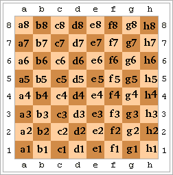

#UNIVERSIDAD TECNOLÓGICA NACIONAL

##FACULTAD REGIONAL ROSARIO

###*ASIGNATURA: "LENGUAJE DE PROGRAMACIÓN: JAVA"*

####*TP1* - Curso Lectivo 2015

#####Equipo Docente

- Ing. Ricardo Tabacman
- Ing. Adrián Meca

#####¿Qué se evalua?
En función de los objetivos propuestos de la  materia  de **lenguaje de programación JAVA** se evaluará la **capacidad del alumno para aprender** y profundizar sus conocimientos en el lenguaje Java.

#####Operatoria
Se realizará en equipos de no más de  3 alumnos. En la solución se debe utilizar el concepto de programación en tres capas. El sistema contará de 2 etapas:
1. Aplicación de escritorio con almacenamiento de la información en base de datos.
2. Aplicación web con almacenamiento de la información en base de datos.

######Fechas de Entrega
- *Etapa 1: 9 de Octubre*
- *Etapa 2: 6 de Noviembre*

#####Enunciado
Se desea realizar un sistema de un juego de ajedrez.
Para el mismo ya se cuenta con un conjunto de jugadores previamente almacenados. De los mismos se conoce el DNI, nombre y apellido.

Cuando dos jugadores desean realizar una partida entre ellos ingresan al sistema un DNI para que lo reconozca y el sistema preguntará si desean iniciar una partida nueva o continuar una anterior.
Las partidas tienen un número de partida que las identifica que el sistema deberá asignar al iniciar una nueva.

Si se continua una partida ya iniciada, se deben listar las que esta jugando en ese momento y luego que seleccione la partida se lista las posiciones de las fichas e indica de quien es el turno  acepta la jugada.

Cuando alguien juega, pide que ficha (trebejo) y que posicion final desea. Antes de actualizar la posición, verifica que sea valida para el juego (solo deberán validarse los movimientos reglamentarios de la ficha, no si hay otra obstruyendo el movimiento de la misma). Si como resultado come otra ficha, se debe actuar en consecuencia. Luego que un jugador finalizó su turno el juego deberá esperar por la jugada del siguiente.
Luego de cada jugada se deberá registrar el cambio del tablero ya que en cualquier momento se puede cerrar la aplicación y continuar luego la partida sin necesidad de guardar la misma.

Además de poder  ingresar los movimientos de la partida, el sistema deberá permitir que en todo momento se liste el estado del tablero: Un tablero indica entonces Ficha y posición, primero blancas y luego negras.

El juego termina cuando un jugador elimina al rey del otro.

######Reglas de Negocio

- Cada partida posee: una identificación, 32 fichas (16 de cada color), dos jugadores, un turno.
- Cada ficha posee, una posición, si esta en tablero (o fue comida) y pertenece a una clase de ficha.
- Cada clase de ficha tiene un conjunto de reglas que determinan que clase de movimientos puede realizar. (Un método que permite verificar si es valido un movimiento propuesto.
- El tablero identifica cada casilla (escaque) con una notación denominada algebraica:
  - El primer carácter identifica siempre la columna de la casilla y se representa por una de las siguientes letras minúsculas: a - b - c - d - e - f - g - h. La columna de la casilla se ordena desde la izquierda del jugador con piezas blancas hasta su derecha.
  - El segundo carácter identifica siempre la fila de la casilla y se representa por un número del 1 al 8, en orden ascendente, desde el lado del jugador de piezas blancas hasta el lado jugador de piezas negras.

      

  - Las casillas, en la posición inicial, de algunas piezas son: torre del lado de la dama blanca a1, dama blanca d1, torre del lado del rey negro h8.
  - Cada pieza tiene una letra mayúscula asociada, y varía en función del idioma de quien realiza la notación. En Español utilizamos: R para el Rey - D para la dama - T para la Torre - A para el alfil - C para el caballo – P para los peones.
